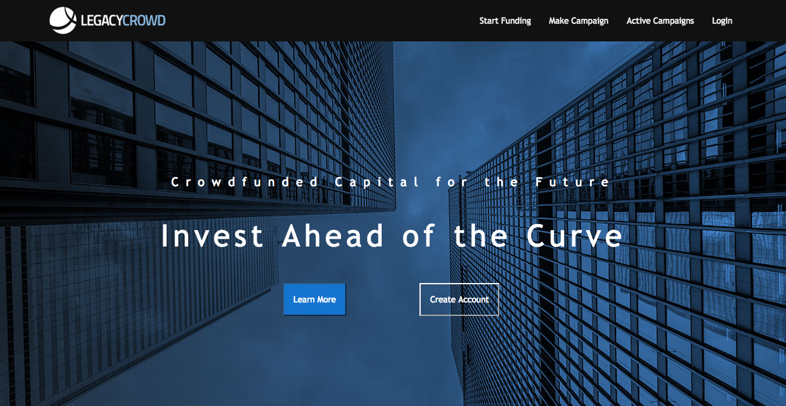
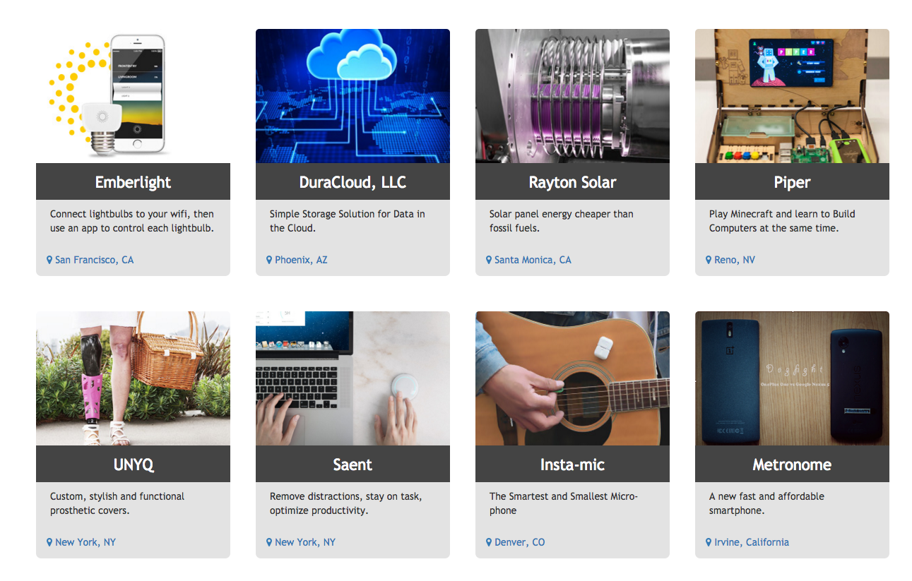
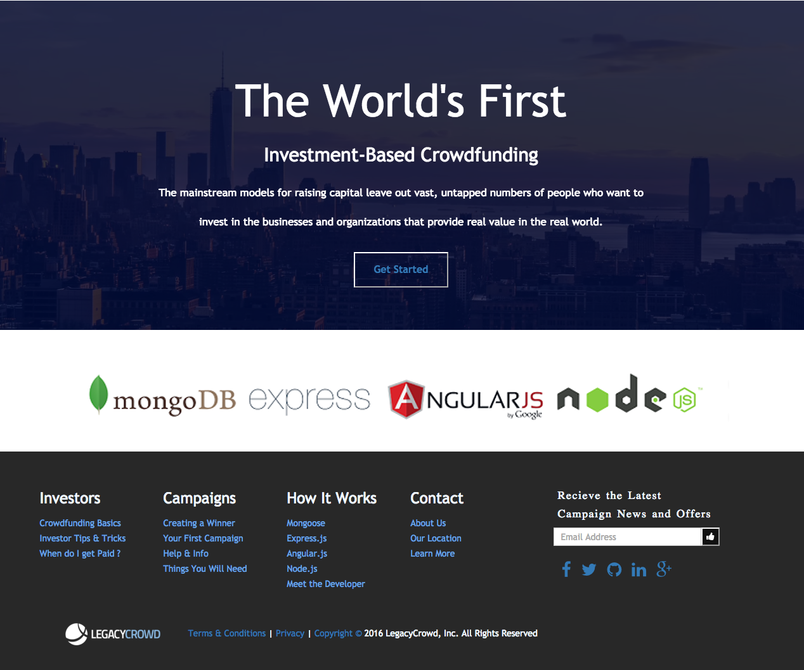

###### Full MEAN Stack JavaScript Project
###### <a href="https://infinite-ocean-83799.herokuapp.com">Hosted Here on Heroku</a>

# LegacyCrowd

### LegacyCrowd is a site for Campaign Contributers who Want to be Investors!

* Start a Campaign & Get Funded!
 * Legacy Crowd is a crowdfunding platform that is <b>completely unique.</b> 
 * Campaigns recieve loans toward funding their idea, their legacy, or their product - rather than donations. 
 * Users of LegacyCrowd become Investors, who contribute to the campaigns they resonate with, recieving their money back <b>with interest!</b>

* Technologies Used:
 * Wireframe planning of each page and feature with Balsamiq 3.
 * Built from scratch using HTML5, CSS3, JQuery, and Bootstrap 3.
 * Employs Angular.js framework to create views, controllers, and front-end $http routes.
 * Uses Express and Node for back-end server routing.
 * Uses Mongoose and MongoDB to store and access a database of Campaigns.
 * Gulp tasks for concatenating and minifying project files, watching for file changes and updating public files throughout development within client-side local files.
 * Test Driven Development using Mocha.

## Initial Wireframe in Balsamiq

